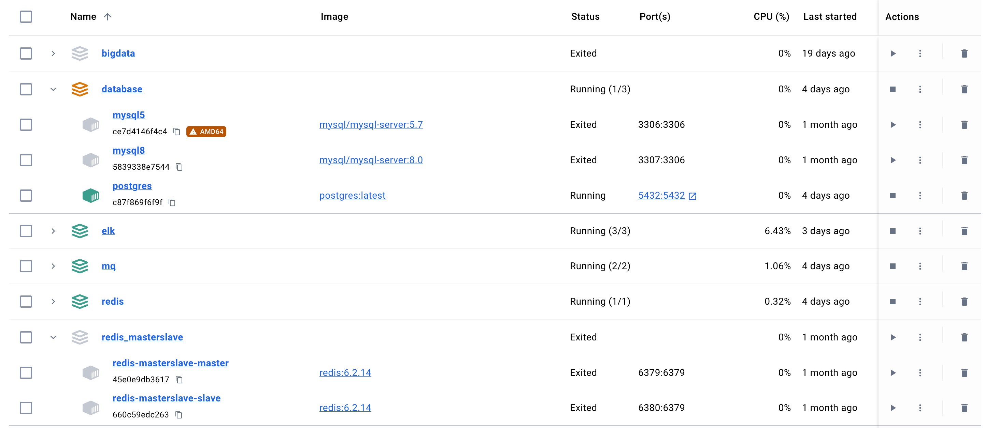

# docker-compose-collection


## Usage
```bash
# install kafka
docker-compose -f mq/docker-compose.yml up -d

# install es、logstash、kibana
docker-compose -f elk/docker-compose.yml up -d

# 等等
```
> 更新配置后，同样执行上面的命令即可生效